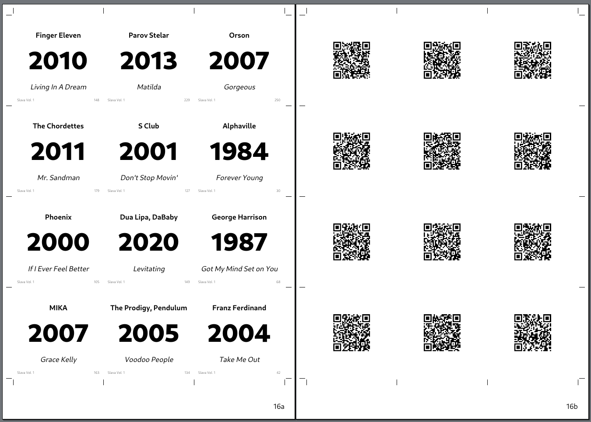

# Spotify QR song card generator

Generates a PDF with cards for a list of music tracks. One side of the card contains track data, another side
contains a QR code with a Spotify link to the track. Spotify Premium subscription is required to use the cards.



## Setup

* Install Python 3.11+
* Create a venv: `python -m venv .venv`
* Activate the venv: `source .venv/bin/activate` (or `./.venv/bin/activate.bat` on Windows)
* Install dependencies: `pip install -r requirements.txt`
* Install librsvg. On Ubuntu:
    ```bash
    sudo apt-get update
    sudo apt-get install librsvg2-bin
    sudo apt-get install fonts-cantarell # Install the font if you don't have it already
    ```

## Track list & metadata

You need a text file with the list of Spotify track IDs. You can use one file per set, but multi-set lists are also
supported. You can refer to the [`example_track_list.txt`](example_track_list.txt) file for the format description.

To create the file you can, for example, use any of the tools that allow you to export the Spotify playlist as a CSV,
then remove CSV columns other than the track ID and save the CSV.

After you've got the track list file, you need to get the track metadata like so:

```bash
python -m fetch_track_metadata <track_list.txt> tracks.json [--set-id <set_id>]
```

(`--set-id` is required if the track list file doesn't have the set ID for every track.)

This will create a `tracks.json` file with the track metadata database. You can use the same metadata database for
multiple sets. If the file already exists the `fetch_track_metadata` tool will add new track information to it.

## Metadata cleanup

`fetch_track_metadata` will clean up some track names for you, but you should also review the metadata to make sure
there is no excess information in the track title, like "Club Mix" etc. You can do it by reviewing the `tracks.json`
file or the resulting PDF.

You can clean up the metadata in two different ways:

* Add new entries into `track_suffixes` and `album_suffixes` lists in `fetch_track_metadata.py` then run the tool again.
  This will clean up track titles and album names in the `title_clean` and `album_clean` fields.
* Specify `title_override`, `artist_override`, and `album_override` fields in the `tracks.json` file manually with the
  preferred values.

Additionally, some remastered tracks have their release dates specified at the time of remastering. You can search for
the "Remast" substring in the track DB and replace the release date with the original release date if necessary.

## Card generation

Once the metadata is ready, you can generate the cards:

```bash
python -m make_qr_cards <track_list.txt> tracks.json
```

For the info on configuration options, run the tool with `--help`:

```bash
python -m make_qr_cards --help
```

```
usage: python -m make_qr_cards [-h] [-o OFFSET_COUNT] [-l LIMIT_COUNT] [-s SET_NAME] [--set-alias SET_ALIAS] [-f FONT_NAME] [-g] [-cm] [--skip-pdf] list_file track_db_file

Generate a PDF with QR codes for a list of music tracks.

positional arguments:
  list_file             Name of file with track ID on each line.
  track_db_file         Name of file with existing track metadata database. Created if it does not exist.

options:
  -h, --help            show this help message and exit
  -o OFFSET_COUNT, --offset OFFSET_COUNT
                        Skip the first N tracks.
  -l LIMIT_COUNT, --limit LIMIT_COUNT
                        Limit the number of tracks.
  -s SET_NAME, --set SET_NAME
                        Only consider tracks from the given set.
  --set-alias SET_ALIAS
                        Name of the set alias to display on the cards.
  -f FONT_NAME, --font FONT_NAME
                        Font to use on the cards. Default is `Cantarell`.
  -g, --grid            Draw a grid around the cards.
  -cm, --crop-marks     Draw crop marks at the sides of the page.
  --skip-pdf            Don't execute the `rsvg-convert` command to combine the SVG files into a PDF. The command can be executed manually: `rsvg-convert --format=pdf
                        --output=build/cards.pdf build/*.svg` Useful when you want to generate SVGs on a Windows machine and only run `rsvg-convert` on Linux.
```

That's it! You now have a `build/cards.pdf` file with the cards that you can print out and cut with a paper cutter or
scissors.

## License

This project is licensed under the
[GNU General Public License][gplv3], version 3. It's originally based on https://github.com/ruuda/hitsgame with heavy
modifications on January 2025.

[gplv3]:   https://www.gnu.org/licenses/gpl-3.0.html
